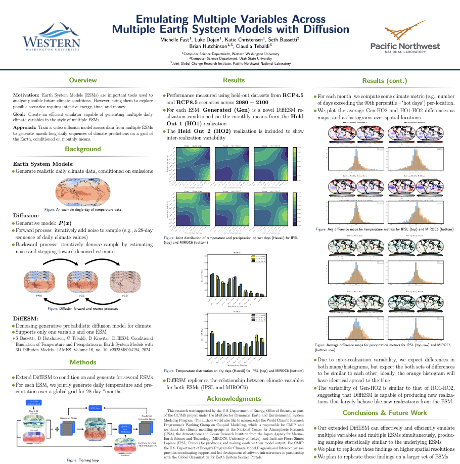

## Multi-ESM Emulation
Train a generative diffusion model on several different Earth-System Models’ (ESM) data to emulate each of them. At inference time, the model is given an emission behavior, starting day, and target ESM with which it generates predictions for Earth’s future climate.

**See poster published to AGU by clicking the preview below!**

